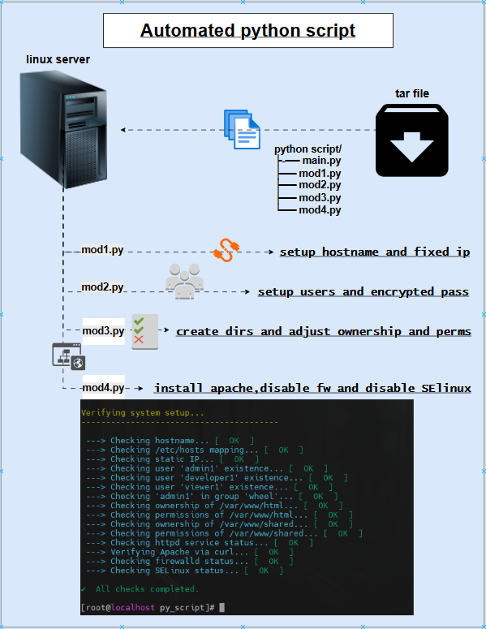

# 🛠 Linux Server Auto-Setup Script (Rocky Linux 9.3)

A modular Python-based automation tool that configures a fresh **Rocky Linux 9.3** server for intranet hosting. It handles hostname setup, static IP configuration, user creation with access levels, directory permissions, Apache installation, and verification — all from one place.

---

## 📦 Features


- ✅ Set hostname and static IP via NetworkManager
- ✅ Append hostname to `/etc/hosts`
- ✅ Create system users (`admin`, `developer`, `viewer`)
- ✅ Set passwords and assign sudo privileges
- ✅ Create and secure directories `/var/www/html` and `/var/www/shared`
- ✅ Install and enable Apache (`httpd`)
- ✅ Disable firewalld and SELinux
- ✅ Deploy static website (HTML + image)
- ✅ Verify setup and print summary
- ✅ Bonus: ASCII logo display via `jp2a` (image-to-terminal)

---

## 📁 Module Breakdown

| Module            | Description                                                  |
|-------------------|--------------------------------------------------------------|
| `mod1.py`         | Hostname config, static IP assignment, and `/etc/hosts` edit |
| `mod2.py`         | User creation and password setup                             |
| `mod3.py`         | Directory creation and ownership/permissions                 |
| `mod4.py`         | Apache installation, firewall/SELinux disable, file deploy   |
| `verify_setup.py` | Post-setup system verification and status check              |
| `main.py`         | Central script that runs all modules in sequence             |

---

## 🚀 How to Run

1. **Install Python & pip**
    ```bash
    sudo dnf install -y python3 python3-pip
    ```

2. **Install required Python packages**
    ```bash
    pip3 install colorama
    ```

3. **Place your `index.html` and `img.webp` in the project folder.**

4. **Run the main script as root**
    ```bash
    sudo python3 main.py
    ```

---

## 🖼 Bonus: ASCII Logo (Optional)

To show an image as ASCII art in terminal (using `jp2a`):

```bash
sudo python3 -c "from verify_setup import show_off; show_off()"
```

> Note: This will install build tools and compile `jp2a` from source.

---

## ✅ Tested On

- ✅ Rocky Linux 9.3 (Minimal ISO)

---

## 🔒 Notes

- Script modifies critical system files (`/etc/hosts`, SELinux config, Apache dirs).
- Only run on test or fresh installs unless you're confident.
- Use at your own risk.

---

## 📄 License

This project is open-source and free to use for educational or internal use. Attribution is appreciated.
